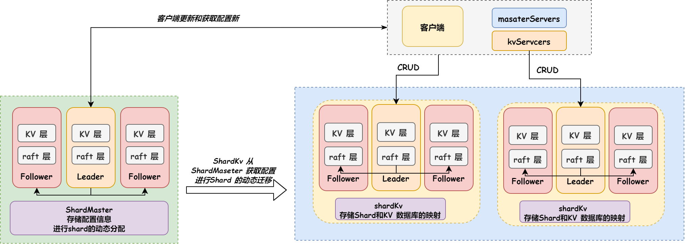

# MIT_RAFT

整个系统分为两层：

1. 底层为 Raft 层，用来处理 Leader 选举、日志复制、数据持久化和恢复等。
2. 上层分为两种：ShardMaster 和 ShardKV。
   1. ShardMaster 负责接收客户端发来的配置信息，进行 Shard 的动态分配，使得各集群负载接近平均值，支持集群的动态添加删除和 Shard 的迁移。
   2. ShardKV 为数据库应用层，负责接收客户端的增删改查请求，转发到 Raft 同步到大多数节点后将数据应用到自身的内存中。 ShardKV 也会定期从 ShardMaster 获取最新的配置信息，根据配置进行 Shard 的动态迁移。

#### 架构图：

#### Raft层：

- 主要用到的数据：
  - 节点的角色：共三种—— Follower、Leader、Candidate。
  - 节点 Id，全局唯一。
  - Term：任期，每一轮投票都会自增 1。
  - CommitIndex：最后一条提交的日志索引，即写入成功的最后一条日志索引。
  - LastIncludedIndex：快照中最后一条日志的索引。
  - LastIncludedTerm：快照中最后一条日志执行时的 Term。
  - nextIndex：Leader 节点用来保存需要同步给所有 Follower 的下一条日志的字典，初始为 Leader 保存的最后一条日志的下一条日志的索引。
  - matchIndex：Leader 节点用来保存已经成功同步给所有 Follower 的最后一条日志的索引的字典。
  - Logs：保存所有未快照日志的切片。每条日志中记录的有索引信息、执行时的 Term 信息、命令信息。
- 数据持久化：
  - 利用**快照**和**日志**相结合的方式保存数据信息，类似于 Redis 中的 RDB + AOF。
  - 快照就是使用二进制格式保存的键值数据库中的数据。
  - 日志就是使用切片保存的所有还未快照过的已经执行过的指令信息。
  - 除此之外还会持久化 Raft 层的状态信息，包括 Term、VoteFor、快照中最后一条日志的信息：LastIncludedIndex、LastIncludedTerm。
  - 每次执行指令时都会将日志和状态信息持久化到硬盘中。
  - 日志容量超过指定的阈值的 2 / 3 时，就会在 KV 层触发快照操作，KV 层会将内存中的数据发送到 Raft 层，Raft 层截断日志并持久化状态信息和接收的 KV 层的数据快照。
- Leader 选举：
  - 每个节点一共可以拥有三种角色：Follower、Leader、Candidate。
  - 节点拥有随机时长的选举定时器，当一段时间内没有接收到 Leader 发来的心跳时，会自动变身为 Candidate，发起投票请求。
  - 初始时，所有节点角色均为 Follower，由于每个节点都拥有一个随机时长的选举定时器，因此会先后触发投票请求。
  - 投票过程：投票分为两步：预先投票和正式投票。
  - 预先投票：节点变身 Candidate 后，会将自身 Term 加 1，然后发起一轮预先投票请求，如果获得了超过半数的选票，则发起正式投票请求，否则将 Term 减 1，重复等待接收其他节点的心跳或者选举定时器超时。
  - 正式投票：首先给自己投一票，并向其他所有结点发送投票请求，请求中携带自身的 Term、LastLogTerm、 LastLogIndex信息。之后会有以下逻辑：
    1. Candidate 若在投票请求过程中受到了其他 Leader 的心跳数据，则退为 Follower，结束竞选。
    2. Candidate 的 Term 小于接收者的 Term，认为是无效的投票请求，拒绝投票。
    3. Candidate 的 Term 若大于接收者的 Term，则更新 Term，并变身为 Follower。
    4. 接收者若判断自己已经在该 Term 投过票给其他人，则拒绝投票。
    5. 接收者若判断 Candidate 的 LastLogTerm 小于自己的 LastLogTerm，则拒绝投票。
    6. 接收者若判断 Candidate 的 LastLogTerm 等于自己的 LastLogTerm，且 LastLogIndex 小于自己的 LastLogIndex，则拒绝投票。
    7. 其余情况接收者均会投票给 Candidate。
    8. 若 Candidate 在一轮选举中未获得超过半数的选票，则在选举定时器超时后会将 Term 加 1，进行下一轮选举。
    9. 若 Candidate 在一轮选举中获得票数超过一半，则成为 Leader，开始定时发送心跳数据，并进行日志同步。
    10. 接收者收到 Leader 的心跳信息后会重置选举定时器。
    11. 接收者若在选举定时器超时前未收到 Leader 的心跳信息，则会变身 Follower，进行新一轮选举。
- 日志复制：
  - 节点在成为 Leader 后，便会定时向 Follower 广播心跳数据，其中包含 Term、Id、commitIndex。还会根据 nextIndex 字典中保存的每个 Follower 需要同步的下一条日志数据，发送还未同步的日志数据。
  - 初始时，每个结点的 nextIndex 均为 Leader 的最后一条日志索引加 1。
  - Follower 在接收到 Leader 发送的心跳数据后，会有以下逻辑：
    1. Leader 的 Term 小于接收者的 Term，认为是日志数据是无效的，回复中会携带自身的 Term 数据。
    2. 若接收者的 Term 小于 Leader 的 Term，则会退为 Follower。
    3. Follower 接收到 Leader 的心跳数据后，判断是否缺失日志，若缺失，则会回复冲突日志索引为缺失的最后一条日志索引。
    4. 如果 Follower 判断 Leader 发来的数据中的 prevLogIndex 位于自身的快照中，则会回复冲突日志索引为快照中最后一条日志索引的下一条。
    5. 如果 Follower 判断 Leader 发来的数据中的 prevLogTerm 和自身保存的该日志的 prevLogTerm 冲突，则表示自己保存了之前一轮任期中还未提交的失效数据，则会回复冲突日志为冲突 Term 的第一条日志索引。
    6. Follower 截断 prevLogIndex 后的所有日志，并将 Leader 发来的日志数据追加到其后。
    7. 修改自身的 CommitIndex 为 Leader 的 CommitIndex 和自己的最小值。
    8. 节点修改 CommitIndex 后，会将上一次提交的日志索引到 CommitIndex 之间的所有操作发送到 KV 层，KV 层根据命令的具体内容做相应的处理。
  - Leader 在收到 Follower 的心跳回复数据后，会有以下的逻辑：
    1. 如果 Follower 的 Term 大于自身的 Term 的话，则会退为 Follower，并忽略之后的所有心跳回复。
    2. 如果 Follower 缺失日志，则会根据缺失的日志索引大小更新 nextIndex 字典，并选择发送新的日志数据或者直接发送快照。若发送快照，Follower 会将先截断日志，将快照数据持久化到本地，然后载入到 KV 层，最后等待 Leader 发送后序数据。
    3. 日志数据同步成功，Leader 更新 matchIndex 字典。
    4. 如果 Leader 判断某条日志已经同步给超过半数的节点，则会更新 CommitIndex。修改 CommitIndex 后，会将上一次提交的日志索引到 CommitIndex 之间的所有操作发送到 KV 层，KV 层根据命令的具体内容做相应的处理。
- 数据恢复 ：
  - 当节点重启后，会加载持久化的数据，首先载入 Raft 层的状态数据，然后载入 KV 层的快照数据，修改 LastLogIndex 和 LastLogTerm 为 CommitIndex 对应日志的 index 和 Term。
  - 载入数据后，从 LastIncludedIndex + 1开始逐条发送日志数据到 KV 层，KV层根据命令的具体内容做相应的处理，直至数据恢复完毕。

#### ShardMaster

- 主要用到的数据：
  - Configs 数组：记录每一次客户端发来的配置信息，包含配置编号、Shard 到集群的映射、集群中的所有节点信息。
  - G2Shard 字典：记录集群到 Shard 的映射。
  - ClerkLog 字典：记录每个客户端已经被执行的最后一条日志索引（每个客户端索引自增），防止重复执行，保证幂等性。
- 配置更新：只有 Leader 节点可以执行客户端的修改操作。
  - 客户端可以对集群的元数据做以下修改：
    - 加入集群。
    - 删除集群。
    - 在集群间移动 Shard。
- Shard 分配：
  - 当 Leader 节点接收到客户端对集群元数据操作后，会对元数据进行响应的修改，每次修改后都会去判断是否需要将 Shard 进行动态分配。
  - 会根据集群所负责的 Shard 个数将所有的集群分为 4 类：tLess、tOk、tPlus、tMore。假设有 s 个 Shard，g 个集群，t = s / g，那么在分配均匀状况下，所有的集群所负责的 Shard 个数要么为 t，要么为 t + 1。故存在 4 种集群：tLess（所负责 Shard 个数小于 t）、tOk（所负责 Shard 个数等于 t）、tPlus（所负责 Shard 个数等于 t + 1）、tMore（所负责 Shard 个数大于 t + 1）。
  - 每次计算重新分配的 Shard 时，逻辑如下：
    1. 统计所有未分配的 Shard。
    2. 将 tMore 中的多余 Shard 置为未分配，直至所有 tMore 集群均变为 tPlus 集群。
    3. 将未分配的 Shard 分配给 tLess，直至所有 Shard 分配完毕或者 tLess 集群全部成为 tOk 集群。
    4. 若 3 中的 Shard 还未分配完毕，则全部分配给 tOk 集群，分配后的集群成为 tPlus 集群。
    5. 若 3 中 tLess 集群还有剩余，则将 tPlus 集群的多余 Shard 分配给 tLess 集群，直至所有 tLess 集群均变为 tOk 集群。

#### ShardKV：

- 主要用到的数据：
  - Gid：集群 Id。
  - Masters：ShardMaster 集群中所有的节点信息。
  - MaxRaftState：用来判断是否需要进行数据快照的阈值，当日志容量超过阈值的 2 / 3 时，就会将数据进行快照，并交付给 Raft 层持久化。
  - SKvDb 字典：Shard 到 KvDb 的映射。
  - SClerkLog 字典：Shard 到 ClerkLog 字典的映射，ClerkLog 字典记录了所有客户端已经执行了的最后一条日志索引（每个客户端索引自增）。
  - Shards 集合：集群所负责的所有 Shard。
  - ShardToSend 切片：每次从 ShardMaster 获取到新的元数据后，需要迁移给其他集群的 Shard。
  - Cfg：保存了从 ShardMaster 获取到的元数据信息。
  - WaitUntilMoveDone 计数器：每次从 ShardMaster 获取到新的元数据后，用来保存需要发送给其他集群和需要接收的 Shard 总数，原子自减直至所有涉及到的需要迁移的 Shard 迁移完毕后置为 0。只有 WaitUntilMoveDone 为 0 时才能从 ShardMaster 获取新的元数据信息。
- 数据迁移：
  - 所有的集群间数据迁移均是由已经拥有 Shard 的集群的 Leader 节点主动发起，将 Shard 的数据在内存中快照后直接发送给新的集群，在这期间旧集群不再处理该 Shard 的任何客户端请求。
  - 接收方 Leader 节点接收到 Shard 快照后，保存并同步给 Follower 节点，之后响应同步成功数据。
  - 发送方接收到同步成功消息后，将数据删除，之后不再拥有该 Shard 的数据。